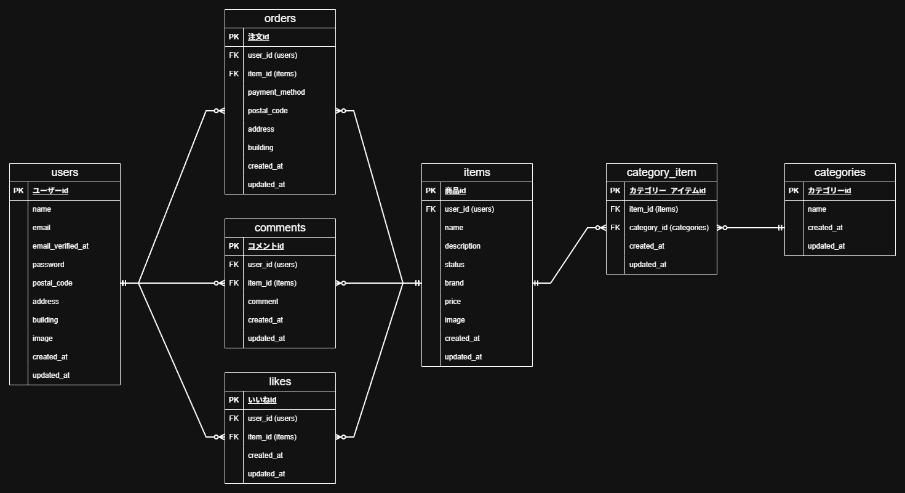

# フリーマーケット

## Dockerビルド
- git clone git@github.com:omu-39/coachtech-freemarket.git
- cd coachtech-freemarket
```
docker run --rm \
    -u "$(id -u):$(id -g)" \
    -v "$(pwd):/var/www/html" \
    -w /var/www/html \
    -e COMPOSER_CACHE_DIR=/tmp/composer_cache \
    laravelsail/php82-composer:latest \
    composer install
```
- ./vendor/bin/sail up -d

## Laravel環境構築
- sail composer install
- cp .env.example .env
- ./vendor/bin/sail artisan key:generate
- ./vendor/bin/sail artisan migrate:fresh --seed
- ./vendor/bin/sail npm install
- ./vendor/bin/sail npm run build
- ./vendor/bin/sail artisan storage:link
- 開発時（Vite）: ./vendor/bin/sail npm run dev

- 以下のキーは取得して設定が必要です：
- `STRIPE_KEY` / `STRIPE_SECRET` : https://dashboard.stripe.com/apikeys

## 使用技術(実行環境)
- PHP 8.2
- Laravel 10.x
- Laravel Sail (Docker)
- Laravel Fortify
- Laravel Cashier
- Tailwind CSS 3.4
- MySQL
- Stripe
- MailhHog

## ER図


## URL
- 商品一覧画面(トップ画面)：http://localhost/
- 商品一覧画面(トップ画面)_マイリスト：http://localhost/?tab=mylist
- 会員登録画面：http://localhost/register
- ログイン画面：http://localhost/login
- 商品詳細画面：http://localhost/item/{item_id}
- 商品購入画面：http://localhost/purchase/{item_id}
- 送付先住所変更画面：http://localhost/purchase/address/{item_id}
- 商品出品画面：http://localhost/sell
- プロフィール画面：http://localhost/mypage
- プロフィール編集画面 (設定画面)：http://localhost/mypage/profile
- プロフィール画面_購入した商品一覧：http://localhost/mypage?page=buy
- プロフィール画面_出品した商品一覧：http://localhost/mypage?page=sell
- メール認証画面 (MailHog)：http://localhost:8025
- phpMyAdmin：http://localhost:8080